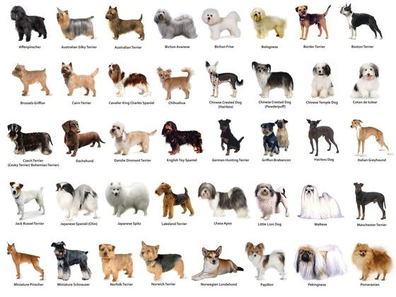

# Titanic-ML-Disaster

## Introduction
The sinking of the RMS Titanic is one of the most infamous shipwrecks in history. On April 15, 1912, during her maiden voyage, the Titanic sank after colliding with an iceberg, killing 1502 out of 2224 passengers and crew. This sensational tragedy shocked the international community and led to better safety regulations for ships.This data science project will give you introdcution on how to use Python to apply various machine learning techniques to the RMS Titanic dataset and predict which passenger would have survived the tragedy.

## Project Overview
In this project, we would build a pipeline that can be used within a web or mobile app to process real-world, user-supplied images.  
Given an image of a dog, your algorithm will identify an estimate of the canine’s breed.  If supplied an image of a human, the code will identify the resembling dog breed.  

![Sample Output][image1]

Along with exploring state-of-the-art CNN models for classification and localization, you will make important design decisions about the user experience for your app.  Our goal is that by completing this lab, you understand the challenges involved in piecing together a series of models designed to perform various tasks in a data processing pipeline.  Each model has its strengths and weaknesses, and engineering a real-world application often involves solving many problems without a perfect answer.  Your imperfect solution will nonetheless create a fun user experience!


## Project Instructions

### Instructions

1. Clone the repository and navigate to the downloaded folder.
	
	```	
		https://github.com/PRkudupu/dog_breed_classifier.git
		cd dog_breed_classifier
	```
3. Dog dataset is under the `dogImages/` folder should contain 133 folders, each corresponding to a different dog breed.
4. Human dataset is under the `lfw` folder.
5. Make sure you have already installed the necessary Python packages according to the README in the program repository.
6. Open a terminal window and navigate to the project folder. Open the notebook and follow the instructions.
	
	```
		jupyter notebook dog_app.ipynb
	```

__NOTE:__ While some code has already been implemented to get you started, you will need to implement additional functionality to successfully answer all of the questions included in the notebook. __Unless requested, do not modify code that has already been included.__

__NOTE:__ In the notebook, you will need to train CNNs in PyTorch.  If your CNN is taking too long to train, feel free to pursue one of the options under the section __Accelerating the Training Process__ below.


## (Optionally) Accelerating the Training Process 

If your code is taking too long to run, you will need to either reduce the complexity of your chosen CNN architecture or switch to running your code on a GPU.  If you'd like to use a GPU, you can spin up an instance of your own:

#### Amazon Web Services

You can use Amazon Web Services to launch an EC2 GPU instance. 
